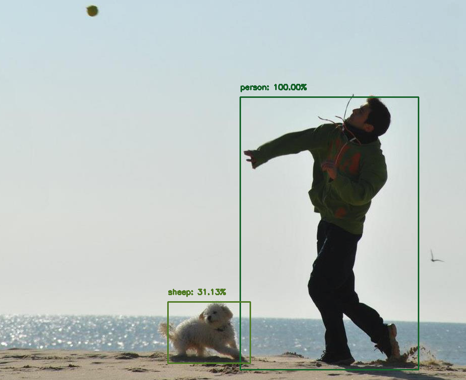

### Ahoy!

I am a Physicist commited to apply the Scientific Method to data. 

Passionate about: data cleaning, pipelines, extracting intelligence from available sources, inferring what is not there and telling the story behind.

- PySpark + Bash.
- Pandas + Sckit-learn + TensorFlow.
- SQL + dashboarding.
- Cloud Functions + Pub/Sub + Scheduler + Transfer + BigQuery.

What happened so that a serious job could be described with emojis?  🐍💥 + 🐍 + 🐼 + 🐬 + 📊  + ☁️ 

- *Currently sharpening my ML skills and finishing an AI master while working.*

 Click to expand.

--------------------------------

A pre-trained NN says it's probable that Copito is a sheep. If 31.13% is he higher score, it means at least there are 3 other classes with lower probability. 
Supposing that *dog* gets the second biggest probability with 31.10%... What the hack could be the other classes? Polar bear? cotton?  Four-legged goddess? 

That's why I love/hate black boxes. They trigger both leisure imagination and work frustration.

--------------------------------

